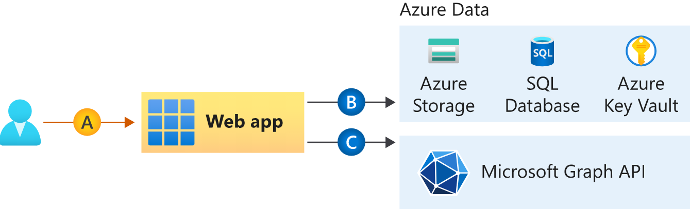

# 🔐 Lab 2 – Secure Web Application with Microsoft Entra ID Authentication

## 📌 Overview

This lab demonstrates how to secure an Azure Web Application using **Microsoft Entra ID** for authentication and authorization. The goal is to show how identity-based access control is implemented in a real-world Azure environment without embedding credentials into the application.

The lab builds on **Lab 1 (Identity & Access Management with Entra ID)** and focuses on application security, enterprise app configuration, and sign-in monitoring.

---

## 🎯 Objectives

* Deploy an Azure App Service (Free tier)
* Enable Microsoft Entra ID authentication
* Require explicit user assignment to the application
* Enforce least-privilege access
* Validate access through sign-in logs

---

## 🧰 Azure Services Used

* Azure App Service (Free F1 tier)
* Microsoft Entra ID
* Enterprise Applications
* App Registrations

> ⚠️ **Cost Note**: This lab was completed using free-tier resources and Entra ID Free. No billable Azure resources were required.

---

## 🗂️ Repository Structure

```
azure-appservice-entra-auth-lab/
├── README.md
├── walkthrough.md
└── screenshots/
    ├── app-service-overview.png
    ├── authentication-enabled.png
    ├── enterprise-app-assignment-required.png
    ├── enterprise-app-user-assigned.png
    ├── developer-access.png
    ├── access-denied.png
    └── app-sign-in-logs.png
```

---

## ✅ Final Outcome

* The web app requires Entra ID authentication
* Only explicitly assigned users can access the app
* Unauthorized users are denied access
* All access attempts are logged and auditable

---

## 🧠 Skills Demonstrated

* Azure App Service deployment
* Entra ID authentication integration
* Enterprise Application management
* Authorization enforcement
* Identity monitoring and auditing
