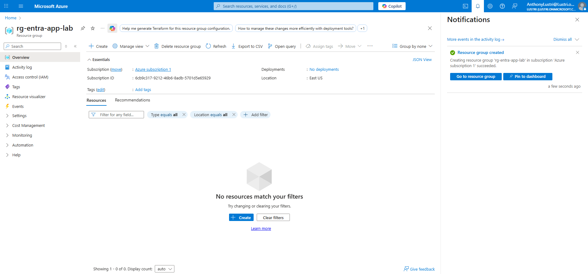
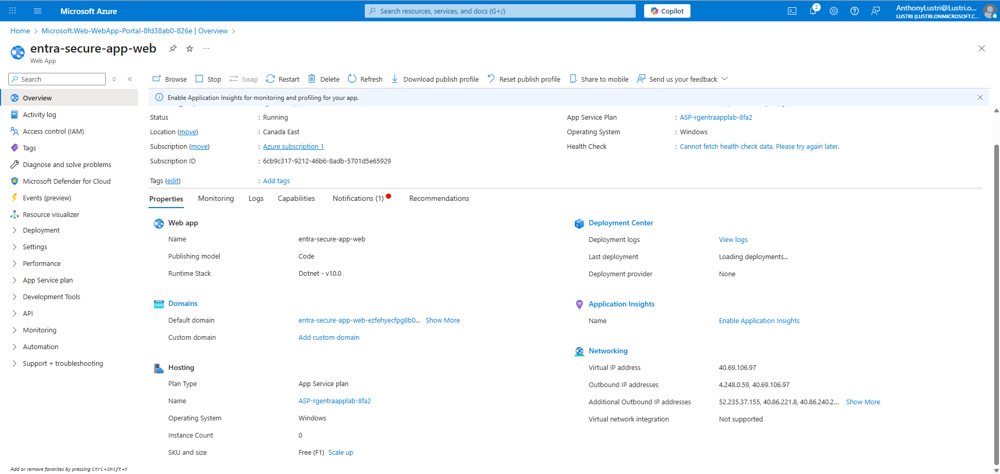
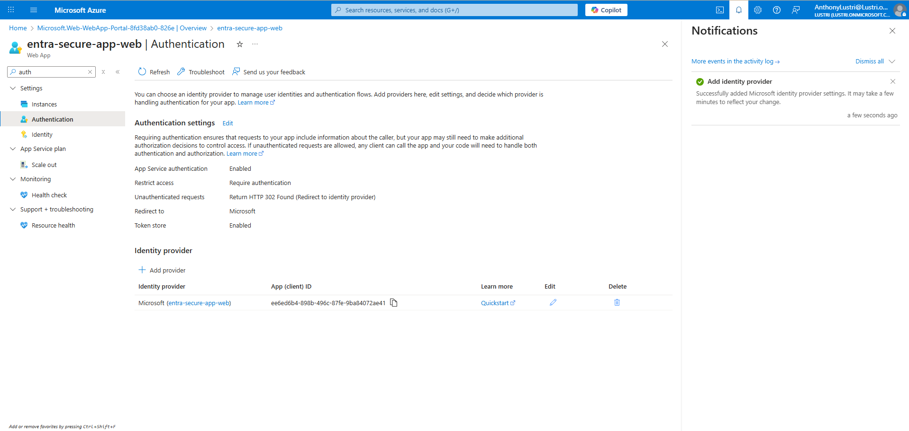
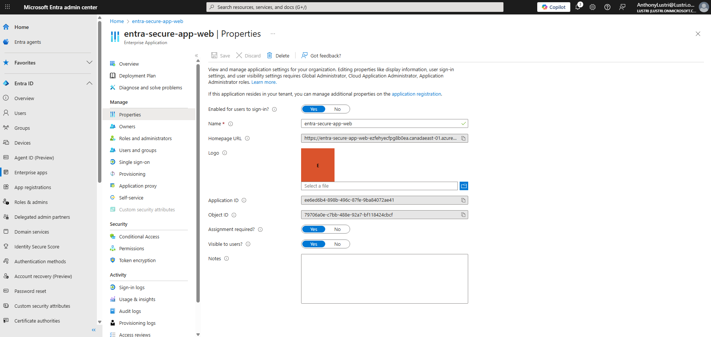
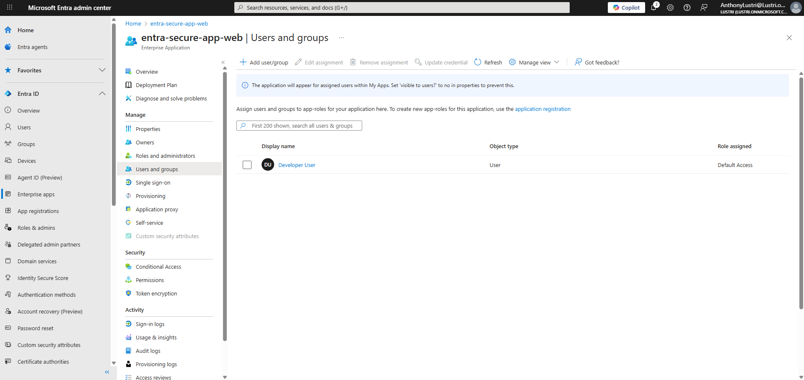
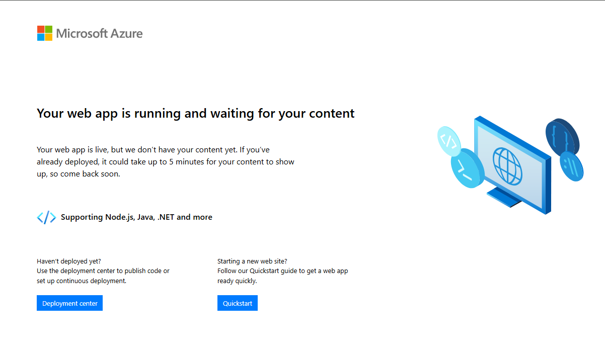
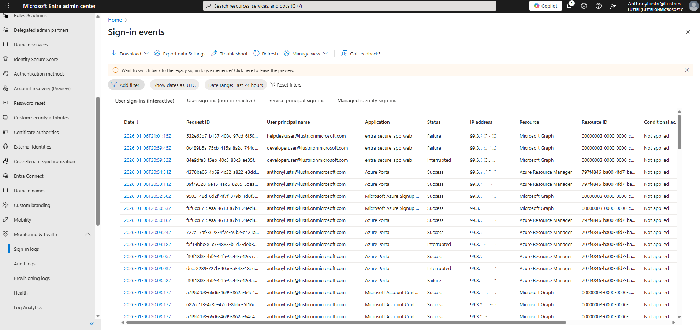

# 🧪 Walkthrough – Secure Web Application with Microsoft Entra ID

This walkthrough provides a step-by-step guide to securing an Azure Web App using Microsoft Entra ID authentication and authorization.

---

## Step 1 – Create Resource Group

A dedicated resource group was created to contain all lab resources.

📸 **Screenshot**

---

## Step 2 – Create Azure App Service (Free Tier)

An Azure App Service was deployed using the Free (F1) tier.

📸 **Screenshot**

---

## Step 3 – Enable Microsoft Entra ID Authentication

Built-in App Service authentication was enabled using Microsoft Entra ID.

Key settings:

* Identity provider: Microsoft
* Tenant: Current tenant (single-tenant)
* Unauthenticated requests: Require authentication

📸 **Screenshot**

---

## Step 4 – Enterprise Application Created

Enabling authentication automatically created an Enterprise Application in Entra ID.

The application was configured to require assignment.

📸 **Screenshot**

---

## Step 5 – Assign Authorized User

Due to Entra ID Free licensing limitations, group-based assignment was unavailable.

Instead, a specific user (Developer User) was assigned to the application.

📸 **Screenshot**

> **Note:** Group-based assignment requires Microsoft Entra ID P1 or higher. User-based assignment was used to remain within free-tier constraints.

---

## Step 6 – Test Authorized Access

The assigned Developer User successfully authenticated and accessed the application.

📸 **Screenshot**

---

## Step 7 – Test Unauthorized Access

A non-assigned user (Helpdesk User) attempted access and was denied.

📸 **Screenshot**

---

## Step 8 – Review Application Sign-In Logs

Sign-in logs were reviewed in the Entra Admin Center and filtered by application name.

This confirmed successful and failed authentication attempts.

📸 **Screenshot**

---

## ✅ Lab Completion

This lab demonstrates secure application access using Microsoft Entra ID, including:

* Centralized authentication
* Explicit authorization
* Least-privilege enforcement
* Auditable sign-in activity
